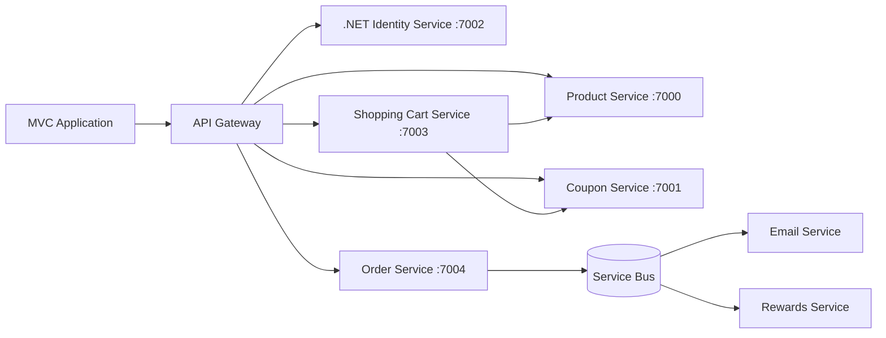

# Mango
## 🏗️ Microservices Architecture Diagram

---

## ✨ Highlights

* 🔐 Authentication via **.NET Identity**
* 🚪 Centralized routing using **API Gateway**
* 🔄 Mix of **sync (HTTP)** + **async (Service Bus)** communication
* ⚡ Event-driven design for scalability
* 🧩 Fully decoupled microservices

---
